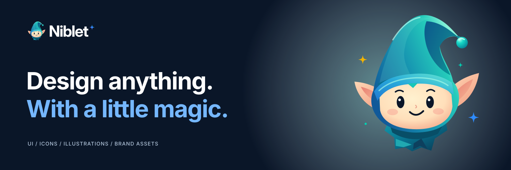
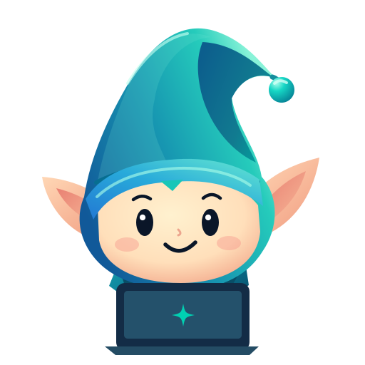

<p align="center">
  
</p>

<h1 align="center">Niblet MCP</h1>

<p align="center">
  
</p>

<p align="center">
  By <a href="https://github.com/elkaix">elkaix</a> for <a href="https://github.com/PyModel">PyModel</a>
</p>

An MCP server that gives a coding agent two things while it builds UI: real screen references from the [Niblet](https://niblet.com) catalogue, and a design skill that keeps the agent working from your product instead of a generic template.

The skill works on its own. The MCP server is optional, and needs a token.

## What you get

Two tools, matching the hosted service exactly:

| Tool | Use it for |
| --- | --- |
| `find_ui_references` | One concrete unresolved question about a layout, state, or interaction. Returns one to three real screens as inline images. |
| `find_ui_materials` | A named font, icon, or animated icon role your design system does not already cover. Returns the recorded license with each result. |

Plus `niblet://skill`, which serves the bundled design workflow and needs no token.

## Connect

You do not have to run this server. If your host speaks HTTP MCP, point it at the hosted endpoint and skip to [the skill](#the-skill):

```sh
claude mcp add --transport http niblet https://api.niblet.com/mcp \
  --header "Authorization: Bearer $NIBLET_TOKEN"
```

To run it locally over stdio instead, add this to your host's MCP config. Node.js 24.15 or later is required; npx fetches the package on first launch.

```json
{
  "mcpServers": {
    "niblet": {
      "command": "npx",
      "args": ["-y", "@pymodel/niblet"],
      "env": { "NIBLET_TOKEN": "<your Niblet API token>" }
    }
  }
}
```

Or with the Claude Code CLI:

```sh
claude mcp add niblet --env NIBLET_TOKEN=$NIBLET_TOKEN -- npx -y @pymodel/niblet
```

Saving the config does not register the server — check the tool list your host actually reports.

Get a token from [niblet.com/docs](https://niblet.com/docs). Keep it in `.env` or your host's environment; never in a committed file or a chat message.

`NIBLET_API_ORIGIN` and `NIBLET_MEDIA_ORIGIN` retarget the server at a local deployment. Leave them unset for production.

## The skill



Install it straight from the repository:

```sh
npx skills add PyModel/niblet-skill-mcp --skill niblet -y
```

Or copy [skill/niblet](skill/niblet) into your host's skill directory yourself, keeping `references/`, `agents/`, `LICENSE`, and `NOTICE` alongside it:

```sh
cp -r skill/niblet ~/.claude/skills/niblet
```

Then ask for it by name:

> Use Niblet to design the checkout empty and error states.
> Run a niblet-skill review of the settings screen.

The [workflow](skill/niblet/SKILL.md) makes the agent establish the screen's job, primary action, hierarchy, existing tokens, real states, and acceptance criteria before it writes anything. It pulls references only when a specific question is still open, and it finishes by rendering the surface and exercising it. A green build is not a pass.

## Contributing

```sh
git clone https://github.com/PyModel/niblet-skill-mcp
cd niblet-skill-mcp
npm ci --ignore-scripts
cp .env.example .env   # then put your token in NIBLET_TOKEN
```

`npm test` covers the tool contract and its failure boundaries. For anything touching startup or configuration, also connect a real MCP client and confirm the tool list and `niblet://skill`. For documentation, check that relative links resolve and that `npm pack --dry-run` still ships what you expect.

[AGENTS.md](AGENTS.md) has the details if you are pointing a coding agent at this repository.

## License

Apache-2.0, copyright 2026 Mohamed Elkholy (elkaix) and PyModel. See [LICENSE](LICENSE).

The skill carries the same licence; keep [skill/niblet/NOTICE](skill/niblet/NOTICE) with it wherever it is installed.
